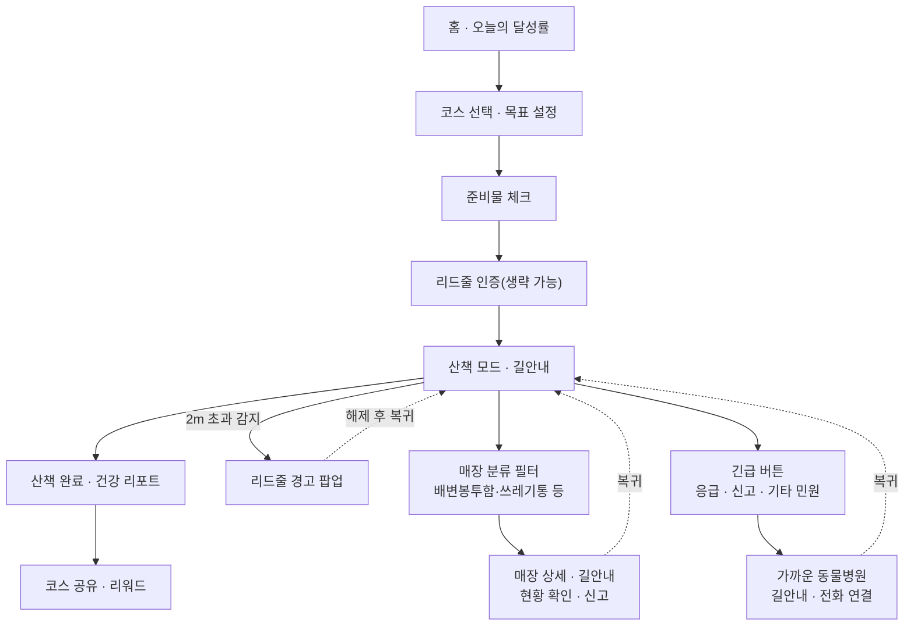

# PRD — HOWPET (Notefolio 프로젝트 329570)

작성일: 2026-09-30 · 작성자: Donghwan Hwang

## 개요

HOWPET은 산책을 하면서 펫티켓을 배우고 실천하게 하는 반려견 산책 앱(iOS)과 스마트워치 앱입니다. 슬로건은 "즐거운 펫티켓, 새로운 산책 문화를 만들어볼까요?"입니다.

| 항목 | 내용 |
| --- | --- |
| 원본 | [HOWPET — Notefolio](https://notefolio.net/dongpang1717/329570) (2022.12.21 게시) |
| 분야 | UX/UI 디자인 · 일러스트레이션, 기여도 100% |
| 도구 | Figma, Illustrator |
| 플랫폼 | 모바일 앱, 스마트워치 앱, 에어태그 연동 |

이 PRD는 포트폴리오에 담긴 리서치, 페르소나, 여정 지도, 와이어프레임, 최종 화면을 개발 가능한 요구사항으로 정리한 문서입니다. 포트폴리오에 없는 수치 목표와 일정은 제안값으로 표시했습니다.

## 배경과 문제 정의

반려가구와 산책 수요는 늘었지만 펫티켓 인지율은 60% 수준에 머물러 있고, 산책 중 사고는 늘고 있습니다. 펫티켓을 "감으로" 지키는 현실을 바꾸려면 산책 흐름 안에서 교육과 실천이 일어나야 합니다.

| 근거 | 수치 | 출처(포트폴리오 인용) |
| --- | --- | --- |
| 도시공원 내 배설물 처리 의무 인지·준수 | 55.9% | KB금융지주 경영연구소, 2018 반려동물보고서 |
| 목줄·입마개 착용 의무 인지·준수 | 51.3% | 상동 |
| 타인 상해 시 과실치사 인지·준수 | 44.9% | 상동 |
| 반려동물 안은 채 운전 금지 인지·준수 | 40.7% | 상동 |
| '개 물림' 119 구급이송 | 1,889명(2014) → 2,111명(2016) → 2,368명(2018) | 소방청 |
| 사고 예방 대책으로 '펫티켓 교육' 선택 | 46% | 서울디지털대 재학생 696명 조사 |

어피니티 다이어그램에서 나온 세 가지 문제와 해결 방향은 다음과 같습니다.

| 문제 영역 | 사용자 목소리 | 해결 방향 |
| --- | --- | --- |
| 산책 중 돌발상황 | "배변봉투를 안 들고 나왔는데 무료 배변봉투함 위치를 알고 싶어", "근처 동물병원이 어디 있을까요?" | 지도 기반 위치 서비스 |
| 산책 중 궁금증 | "훈련사님 의견도 듣고 싶어요", "동네 반려견 동반 장소를 방문하고 싶다" | 동네 반려인 게시판 |
| 산책의 성과 | "리드줄 착용 인증으로 깨어있는 반려인임을 인증하고 싶어", "걷기 챌린지로 포인트도 쌓고 싶어" | 인증 기반 리워드 |

## 목표와 성공 지표

제품 목표는 세 가지입니다. 산책 흐름 안에서 펫티켓을 배우게 하고, 실천을 인증·보상하고, 돌발상황에서 즉시 도움을 주는 것입니다. 아래 목표치는 포트폴리오에 없는 제안값이며 출시 전 합의가 필요합니다.

| 목표 | 지표 | 제안 목표(출시 3개월) |
| --- | --- | --- |
| 펫티켓 학습 | 주 1회 이상 펫티켓 퀴즈 참여율 | 주간 활성 사용자의 40% |
| 펫티켓 실천 | 산책 시작 전 리드줄 인증 완료율 | 산책 세션의 70% |
| 펫티켓 실천 | 산책당 리드줄 2m 초과 경고 횟수 | 4주차에 1주차 대비 30% 감소 |
| 산책 습관 | 산책 목표 달성률 | 세션의 60% |
| 산책 습관 | 4주 리텐션 | 35% |
| 동네 커뮤니티 | 산책 코스 공유·장소 후기 작성 사용자 비율 | 월간 활성 사용자의 15% |
| 돌발상황 대응 | 긴급 버튼에서 병원 길안내 또는 전화까지 걸린 시간 | 중앙값 30초 이내 |

## 타깃 사용자와 페르소나

핵심 타깃은 실외배변 때문에 매일 산책하는 도심의 직장인 반려인입니다. 처음 반려견을 맞은 초보 견주는 보조 타깃입니다.

**페르소나: 황지은(34세, 입시학원 수학강사) · 반려견 노마(4살 시바견, 중형견)**

> "눈이 오나 비가 오나 실외배변을 위한 산책을 떠나요, 함께 지켜나가는 건강한 산책이 필요해요!"

| 항목 | 내용 |
| --- | --- |
| 산책 빈도 | 주 7일, 하루 평균 2회 |
| 산책 시간대 | 출근 전 오전 8–9시, 퇴근 후 저녁 10시 이후 |
| 회당 산책 시간 | 평균 30분–1시간 |
| 특성 | 펫티켓 지식 중상, 산책 빈도 매우 높음, 친목·행사 참여는 낮은 편 |

| Pain point | Goal |
| --- | --- |
| 매일 같은 코스라 견주도 반려견도 지친다 | 동네의 새로운 산책코스와 반려동물 동반장소를 알고 싶다 |
| 배변봉투함·수거함 위치와 현황을 모른다 | 지도에서 배변봉투함을 확인하고 싶다 |
| 목줄 없는 개가 달려들면 노마가 흥분한다 | 돌발상황 대처 가이드와 신고 기능이 필요하다 |

## 핵심 사용자 시나리오

핵심 시나리오는 출근 전 산책 한 번입니다. 홈에서 출발해 리드줄 인증을 거치고, 산책 중 생기는 일은 산책 모드 안에서 처리한 뒤 완료 리포트로 끝납니다.

포트폴리오의 여정 지도는 "산책 갈지 말지 결정 → 공원 산책 → 배변 활동 → 돌발상황 → 집 돌아가기" 5단계입니다. 감정이 가장 낮은 지점은 배변봉투를 두고 왔을 때, 혼자만 펫티켓을 지킨다고 느낄 때, 귀갓길에 쓰레기통이 없을 때입니다. 세 지점 모두 위 플로우의 매장 필터와 리워드로 대응합니다.

## 기능 요구사항

MVP(P0)는 산책 하나를 처음부터 끝까지 완성하는 기능입니다. 홈, 산책 준비, 리드줄 인증, 산책 모드, 배변봉투함 지도, 긴급상황, 산책 완료가 여기에 들어갑니다. 우선순위는 포트폴리오의 여정 지도 인사이트를 기준으로 제안한 값입니다.

| ID | 영역 | 요구사항 | 수용 기준 | 우선순위 |
| --- | --- | --- | --- | --- |
| F-01 | 홈 | 오늘의 산책 달성률(시간·거리·칼로리)과 마지막 산책 후 경과 시간을 보여준다 | "노마의 마지막 산책이 7시간 지났어요" 문구와 달성률 바가 실시간으로 갱신된다 | P0 |
| F-02 | 홈 | 우리동네 펫플레이스 카테고리(카페, 식당, 간식/용품, 공원, 운동장, 미용, 복합문화, 유치원, 병원, 기타)를 제공한다 | 카테고리를 누르면 현위치 기준 목록이 열린다 | P1 |
| F-03 | 홈 | 테마별 추천 산책코스(지역, 난이도, 소요시간, 거리, 태그)와 핫플레이스 카드를 보여준다 | 코스 카드에 난이도·약 소요분·km가 표시된다 | P1 |
| F-04 | 홈 | 우리동네 게시판에 '나의 견종만 보기' 필터를 제공한다 | 토글 ON 시 등록된 견종의 글만 노출된다 | P2 |
| F-05 | 펫티켓 퀴즈 | 매일 O/X 퀴즈 1문항, 힌트, 정답 제출, 펫티켓 뉴스(체크리스트)를 제공한다 | 정답 시 +500포인트가 지급되고 리워드 팝업이 뜬다 | P1 |
| F-06 | 산책 코스 | 반려견 나이·견종 기준 하루 권장 산책량을 자동 설정하고 수동 수정할 수 있다 | "노마 · 시바견 · 4년4개월 · 하루 권장 1시간"처럼 표시되고 '목표 설정'으로 바꿀 수 있다 | P0 |
| F-07 | 산책 코스 | 다른 사용자가 공유한 테마 코스를 고르거나, 고르지 않고 자유 코스로 시작한다 | 코스 카드 가로 스크롤, 미선택 시 자유 코스 | P1 |
| F-08 | 산책 준비 | 준비물(리드줄, 배변봉투, 인식표, 간식, 물) 체크리스트를 보여준다 | 모두 체크하면 '산책준비 완료'가 활성화된다 | P0 |
| F-09 | 리드줄 인증 | 가이드라인 영역에 맞춰 리드줄을 찬 반려견의 뒷모습을 촬영해 인증한다 | 인증 또는 건너뛰기를 고를 수 있고, 인증 여부가 산책 기록에 남는다 | P0 |
| F-10 | 리드줄 인증 | 에어태그로 보호자와 반려견의 거리를 감지해 2m를 넘으면 경고 팝업을 띄운다 | "리드줄이 너무 길어요!! 산책 시 리드줄은 2m 이내로" 팝업, 2m 안으로 들어오면 닫힌다. 누적 횟수가 상단에 표시된다 | P0 |
| F-11 | 산책 모드 | 코스 선택 시 내비게이션처럼 턴 안내(예: "100m 앞에서 우회전")를 한다 | 경로와 현위치가 지도에 표시되고 목적지까지 확인된다 | P0 |
| F-12 | 산책 모드 | 시간·거리·칼로리와 목표 달성률을 실시간으로 보여주고 '산책 종료'를 제공한다 | "목표달성까지 12분 남았어요 · 73%" 형식 | P0 |
| F-13 | 매장 필터 | 배변봉투함, 쓰레기통, 간식&용품, 미용, 식당, 카페, 운동장, 공원, 유치원, 복합문화, 병원, 기타 분류로 지도 핀을 거른다 | 선택한 필터는 다음에도 유지되고 '재설정'으로 초기화된다 | P0 |
| F-14 | 매장 상세 | 지도 아이콘을 누르면 상세 카드(사진, 분류, 거리, 좋아요·댓글 수, 길안내받기)가 뜬다 | 배경을 누르면 산책 모드로 돌아간다 | P0 |
| F-15 | 매장 상세 | 배변봉투함·쓰레기통은 봉투·수거 현황(여유있음/여유없음)을 보여주고 신고 버튼으로 민원을 접수한다 | 신고 접수 후 확인 메시지가 뜬다 | P1 |
| F-16 | 긴급상황 | 산책 모드의 긴급 버튼으로 응급상황 / 신고하기(펫티켓 미준수자) / 기타 민원 접수를 고른다 | 선택지는 빨간색과 캐릭터로 구분되고, 2단계 안에 접수된다 | P0 |
| F-17 | 긴급상황 | 응급상황이면 가장 가까운 동물병원 안내 또는 상황별 응급 매뉴얼을 고를 수 있다 | 병원 상세(영업시간, 전화, 주소, 후기), 빨간 경로 길안내, 남은 거리, '병원으로 전화하기'와 '응급상황 종료'가 있다 | P0 |
| F-18 | 산책 완료 | 경로 지도, 시간·거리·칼로리, 같은 견종·연령대 평균 대비 산책량을 보여준다 | "청년기(3–6년) 시바견 기준 평균 이상" 스케일바가 표시된다 | P0 |
| F-19 | 산책 완료 | 산책 중 받은 리드줄 경고를 요약해 보여준다 | "리드줄 경고를 두번이나 받았어요" 배너 | P1 |
| F-20 | 건강 리포트 | 웨어러블 데이터로 심박수, 체온, 수분, 칼로리를 적정/주의로 판정하고 조언을 준다 | 예: 심박수 80–100bpm 적정, 체온 38℃ 적정, 수분 1kg당 80ml 기준 | P2 |
| F-21 | 코스 공유 | 완료한 산책 코스를 다른 사용자 추천에 공유한다 | 공유한 코스가 F-07 목록에 노출된다 | P1 |
| F-22 | 리워드 | 업적 배지와 포인트를 지급한다(산책의 첫걸음 +300, 퀴즈 정답 +500, 펫플레이스 후기, 하루 산책 5회, 우리동네 경비대 +1000 등) | 달성 시 팝업과 '포인트 사용하러가기'가 뜬다 | P1 |
| F-23 | 스마트워치 | 산책 알림, 길안내, 필터, 산책 일시정지·잠금, 시간·거리, 리드줄 경고, 건강 리포트를 워치에서 제공한다 | 폰 없이 워치만으로 산책을 이어갈 수 있다 | P2 |
| F-24 | 커뮤니티 | 동네 게시판(동네이야기, 전문가상담)에서 글과 답변을 남긴다 | 하단 탭 '커뮤니티'에서 접근한다 | P2 |

하단 탭은 홈 · 산책하기 · 커뮤니티 · 스토어 · 마이페이지 5개입니다. 스토어의 상세 범위는 오픈 이슈에 남겨 두었습니다.

## 비기능 요구사항과 디자인 가이드

산책 중에는 한 손에 리드줄, 다른 손에 배변봉투를 든 상태로 앱을 씁니다. 그래서 한눈에 읽히는 화면, 짧은 단계, 워치 대체가 비기능 요구사항의 중심입니다.

| 항목 | 요구사항 |
| --- | --- |
| 위치·배터리 | 산책 모드에서 백그라운드 위치 추적을 유지한다. 1시간 산책의 배터리 소모 목표는 오픈 이슈이다 |
| 에어태그 연동 | 2m 초과 감지가 지연 없이 반영돼야 한다. UWB 지원 기기와 미지원 기기의 동작 차이는 오픈 이슈이다 |
| 긴급 동선 | 긴급 버튼은 산책 모드 지도 위에 항상 보이고, 병원 전화까지 3탭 이내로 도달한다 |
| 웨어러블 | watchOS에서 길안내, 경고, 시간·거리, 건강 리포트를 폰과 동기화한다 |
| 개인정보 | 위치·산책 경로는 동의 후 수집한다. 코스 공유 시 집 근처 출발·도착 구간은 가린다 |
| 데이터 신뢰도 | 배변봉투함·쓰레기통 현황은 갱신 시각을 함께 표시한다. 건강 판정에는 의료 진단이 아님을 안내한다 |

| 디자인 원칙 | 내용 |
| --- | --- |
| 브랜드 컬러 | 메인 그린, 보조 옐로(캐릭터), 퀴즈 화면은 다크 네이비 |
| 상태 컬러 | 경고·긴급은 레드로 통일하고 긴급 모드에서는 경로와 버튼까지 레드로 전환한다 |
| 캐릭터 | 시바견 캐릭터가 배지별 코스튬(학사모, 경찰, 의사)으로 보상과 상황을 전달한다 |
| 톤 | "~해요", "~하세요!" 같은 친근한 말투로 반려견 이름을 불러준다 |

## 범위 제외, 가정, 리스크, 오픈 이슈

가장 큰 리스크는 공공시설 데이터와 반려견 웨어러블이라는 외부 의존성입니다.

**범위 제외(MVP)**

- 스토어 결제와 포인트 교환
- 동물병원 예약·진료 연동(전화 연결까지만 제공)
- 전문가 상담의 유료 운영

**가정**

- 사용자는 에어태그를 가지고 있거나 구매할 의향이 있다.
- 지자체 배변봉투함·쓰레기통 위치 데이터를 구할 수 있다.

| 리스크 | 영향 | 대응 |
| --- | --- | --- |
| 봉투함 현황(여유있음/없음) 실시간 데이터 부재 | F-15 신뢰도 저하 | 사용자 제보와 신고로 현황을 갱신하고 갱신 시각 표시 |
| 반려견용 심박·체온 측정 기기 보급 부족 | F-20 사용률 낮음 | P2로 두고, 없는 항목은 숨김 |
| 리드줄 인증이 번거로움 | 산책 시작 이탈 | 건너뛰기 허용, 인증 시 포인트 보상 |
| 미준수자 신고 남용·분쟁 | 커뮤니티 갈등 | 신고는 공개하지 않고 민원 접수로만 처리 |

**오픈 이슈**

- [ ] 에어태그 거리 측정 정밀도(UWB 미지원 기기 포함)로 2m 판정이 가능한가?
- [ ] 신고하기·기타 민원 접수는 어느 기관(지자체, 콜센터)으로 전달하는가?
- [ ] 스토어 탭의 범위와 포인트 사용처는 무엇인가?
- [ ] 견종·연령대별 권장 산책량과 평균값의 데이터 출처는 어디인가?
- [ ] Android·Wear OS 지원 여부

## 마일스톤과 릴리스 계획

세 단계로 나눠 출시합니다. 포트폴리오에는 일정이 없어 날짜는 정하지 않았습니다.

1. **MVP — 안전한 산책 하나 완성(P0)**: 홈 달성률, 목표 설정, 준비물 체크, 리드줄 인증·에어태그 경고, 길안내, 매장 필터·상세, 긴급상황, 산책 완료. 다음 단계 조건: 리드줄 인증율과 경고 감소 추이 확인
2. **참여·보상(P1)**: 펫티켓 퀴즈, 리워드·배지, 테마 코스 추천과 공유, 펫플레이스, 봉투함 현황·신고
3. **확장(P2)**: 스마트워치 앱, 건강 리포트, 동네 게시판·전문가상담, 스토어
